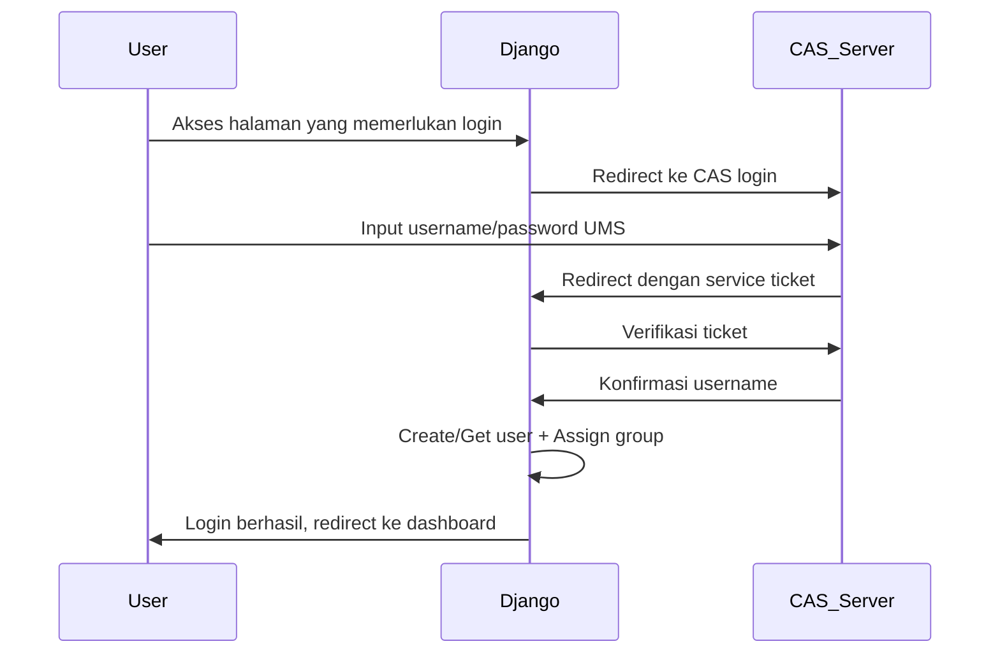

# OSCE Keperawatan - CAS Authentication Implementation

Sistem OSCE (Objective Structured Clinical Examination) Keperawatan dengan integrasi Central Authentication Service (CAS) dari UMS.

## 📋 Daftar Isi

- [Gambaran Umum](#gambaran-umum)
- [Fitur CAS](#fitur-cas)
- [Persyaratan](#persyaratan)
- [Instalasi](#instalasi)
- [Konfigurasi CAS](#konfigurasi-cas)
- [Struktur Implementasi](#struktur-implementasi)
- [Cara Kerja](#cara-kerja)
- [Troubleshooting](#troubleshooting)
- [Pengembangan](#pengembangan)

## 🎯 Gambaran Umum

Aplikasi ini menggunakan sistem autentikasi terpusat CAS (Central Authentication Service) dari Universitas Muhammadiyah Surakarta (UMS) untuk memungkinkan login dengan kredensial institusi yang sudah ada.

### Fitur CAS

- ✅ **Single Sign-On (SSO)**: Login sekali untuk mengakses semua aplikasi
- ✅ **Automatic User Creation**: Pembuatan user otomatis saat login pertama kali
- ✅ **Role-based Assignment**: Penentuan role otomatis berdasarkan pola username
- ✅ **Group Management**: Pengelompokan user otomatis (Dosen/Mahasiswa)
- ✅ **Secure Logout**: Logout dari semua aplikasi yang terintegrasi
- ✅ **Session Management**: Pengelolaan sesi yang aman dan konsisten

## 📦 Persyaratan

### Software Requirements
- Python 3.8+
- Django 4.2+
- django-cas-ng 5.0+

### System Requirements
- Akses internet untuk koneksi ke CAS server UMS
- Environment variables untuk konfigurasi

## 🔧 Instalasi

### 1. Clone Repository
```bash
git clone <repository-url>
cd osce_keperawatan
```

### 2. Setup Virtual Environment
```bash
python -m venv env
source env/bin/activate  # Linux/Mac
# atau
env\Scripts\activate     # Windows
```

### 3. Install Dependencies
```bash
pip install -r requirements.txt
pip install django-cas-ng
```

### 4. Environment Setup
Buat file `.env` di root project:
```env
SECRET_KEY=your-secret-key-here
DEBUG=True
ALLOWED_HOSTS=localhost.ums.ac.id,127.0.0.1
CAS_SERVER_URL=https://auth.ums.ac.id/cas/
```

### 5. Database Migration
```bash
python manage.py makemigrations
python manage.py migrate
```

### 6. Run Server
```bash
python manage.py runserver
```

## ⚙️ Konfigurasi CAS

### 1. Django Settings Configuration

File: `osce_project/settings.py`

```python
# Installed Apps
INSTALLED_APPS = [
    # ... other apps
    'django_cas_ng',
    # ... other apps
]

# Middleware
MIDDLEWARE = [
    # ... other middleware
    'django_cas_ng.middleware.CASMiddleware',
    # ... other middleware
]

# Authentication Backends
AUTHENTICATION_BACKENDS = [
    'django.contrib.auth.backends.ModelBackend',
    'osce_project.cas_backends.CustomCASBackend',
]

# CAS Configuration
CAS_SERVER_URL = 'https://auth.ums.ac.id/cas/'
CAS_VERSION = '3'
CAS_LOGOUT_COMPLETELY = True
CAS_PROVIDE_URL_TO_LOGOUT = True
CAS_CHECK_NEXT = True
CAS_IGNORE_REFERER = True

# User Creation Settings
CAS_CREATE_USER = True
CAS_USERNAME_ATTRIBUTE = 'uid'
CAS_APPLY_ATTRIBUTES_TO_USER = True

# Attribute Mapping
CAS_RENAME_ATTRIBUTES = {
    'mail': 'email',
    'givenName': 'first_name',
    'sn': 'last_name',
}

# Additional Settings
CAS_FORCE_CHANGE_USERNAME_CASE = 'lower'
CAS_STORE_NEXT = True
CAS_VERIFY_SSL_CERTIFICATE = False  # Untuk development

# Login/Logout URLs
LOGIN_URL = '/accounts/login/'
LOGIN_REDIRECT_URL = '/dashboard/'
LOGOUT_REDIRECT_URL = '/'
```

### 2. URL Configuration

File: `osce_project/urls.py`

```python
import django_cas_ng.views as cas_views

urlpatterns = [
    # CAS Authentication URLs
    path('accounts/login/', cas_views.LoginView.as_view(), name='cas_ng_login'),
    path('accounts/logout/', cas_views.LogoutView.as_view(), name='cas_ng_logout'),
    path('accounts/callback/', cas_views.CallbackView.as_view(), name='cas_ng_proxy_callback'),
    # ... other URLs
]
```

## 🏗️ Struktur Implementasi

### 1. Custom CAS Backend

File: `osce_project/cas_backends.py`

```python
class CustomCASBackend(CASBackend):
    """Custom CAS Backend dengan verifikasi yang ditingkatkan"""
    
    def authenticate(self, request, ticket, service, **kwargs):
        # Implementasi custom authentication
        # Mencegah double ticket usage
        # Enhanced logging untuk debugging
        pass
    
    def _custom_verify_and_create_user(self, ticket, service):
        # Custom ticket verification
        # User creation dengan error handling
        pass
```

### 2. Automatic Group Assignment

File: `landing/signals.py`

```python
@receiver(user_logged_in)
def assign_user_group(sender, request, user, **kwargs):
    """
    Penentuan group otomatis berdasarkan panjang username:
    - Username ≥ 5 karakter: Mahasiswa (NIM)
    - Username < 5 karakter: Dosen (UNIID)
    """
    if len(user.username) >= 5:
        group, created = Group.objects.get_or_create(name='mahasiswa')
        user.groups.add(group)
    else:
        group, created = Group.objects.get_or_create(name='dosen')
        user.groups.add(group)
```

### 3. Apps Registration

File: `landing/apps.py`

```python
class LandingConfig(AppConfig):
    def ready(self):
        import landing.signals  # Import signals untuk auto-assignment
```

## 🔄 Cara Kerja

### 1. Flow Authentication



### 2. User Role Assignment Logic

```python
def determine_user_role(username):
    """
    Logika penentuan role user:
    - UNIID (Dosen): Format pendek < 5 karakter (contoh: 'ps839')
    - NIM (Mahasiswa): Format panjang ≥ 5 karakter (contoh: 'K100220001')
    """
    if len(username) >= 5:
        return 'mahasiswa'
    else:
        return 'dosen'
```

### 3. Database Integration

- **Dosen**: Disinkronkan dengan tabel `master_dosen` berdasarkan `uniid`
- **Mahasiswa**: Disinkronkan dengan tabel `master_mahasiswa` berdasarkan `nim`
- **Groups**: Django groups untuk permission management

## 🐛 Troubleshooting

### Common Issues

#### 1. 403 Forbidden Error
```
Problem: CAS login mengembalikan 403 error
Solution: 
- Pastikan CAS_SERVER_URL benar: 'https://auth.ums.ac.id/cas/'
- Periksa ALLOWED_HOSTS mencakup domain yang digunakan
- Verifikasi service URL yang dikirim ke CAS server
```

#### 2. "Service ticket already been used"
```
Problem: Ticket CAS digunakan dua kali
Solution:
- Gunakan CustomCASBackend yang mencegah double verification
- Pastikan hanya satu authentication backend yang memverifikasi ticket
```

#### 3. User tidak ter-assign ke group
```
Problem: User login berhasil tapi tidak masuk group yang tepat
Solution:
- Periksa signals.py sudah di-import di apps.py
- Verifikasi logika panjang username sesuai dengan data actual
- Check Django logs untuk error dalam signal handler
```

#### 4. SSL Certificate Error
```
Problem: SSL verification error saat koneksi ke CAS server
Solution:
- Set CAS_VERIFY_SSL_CERTIFICATE = False untuk development
- Untuk production, pastikan certificate CAS server valid
```

### Debug Mode

Untuk debugging yang lebih detail, aktifkan logging:

```python
LOGGING = {
    'version': 1,
    'disable_existing_loggers': False,
    'handlers': {
        'console': {
            'class': 'logging.StreamHandler',
        },
    },
    'loggers': {
        'django_cas_ng': {
            'handlers': ['console'],
            'level': 'DEBUG',
            'propagate': True,
        },
        'osce_project.cas_backends': {
            'handlers': ['console'],
            'level': 'DEBUG',
            'propagate': True,
        },
    },
}
```

## 🚀 Pengembangan

### Testing CAS Integration

```python
# Test manual di Django shell
python manage.py shell

# Test user creation
from django.contrib.auth.models import User, Group
user = User.objects.get(username='ps839')
print(f"User: {user.username}")
print(f"Groups: {[g.name for g in user.groups.all()]}")

# Test group assignment logic
def test_username_logic(username):
    if len(username) >= 5:
        return 'mahasiswa'
    else:
        return 'dosen'

print(test_username_logic('ps839'))      # Output: dosen
print(test_username_logic('K100220001')) # Output: mahasiswa
```

### Extending Functionality

1. **Custom User Attributes**:
   ```python
   # Tambah mapping attribute dari CAS
   CAS_RENAME_ATTRIBUTES = {
       'mail': 'email',
       'givenName': 'first_name',
       'sn': 'last_name',
       'departmentNumber': 'department',
   }
   ```

2. **Advanced Role Logic**:
   ```python
   # Implementasi logika role yang lebih kompleks
   def advanced_role_assignment(user, cas_attributes):
       # Logic berdasarkan department, role, dll
       pass
   ```

### Production Considerations

1. **Security**:
   - Set `CAS_VERIFY_SSL_CERTIFICATE = True`
   - Gunakan HTTPS untuk aplikasi
   - Proper secret key management

2. **Performance**:
   - Database indexing untuk username lookup
   - Caching untuk group assignments
   - Session management optimization

3. **Monitoring**:
   - Log authentication attempts
   - Monitor failed logins
   - Track user role assignments

## 📞 Support

Untuk bantuan lebih lanjut:
- Check Django dan django-cas-ng documentation
- Review CAS server logs di UMS
- Test dengan user credentials yang valid

---

**Note**: Implementasi ini khusus disesuaikan untuk integrasi dengan sistem CAS UMS dan pola username institusi.
